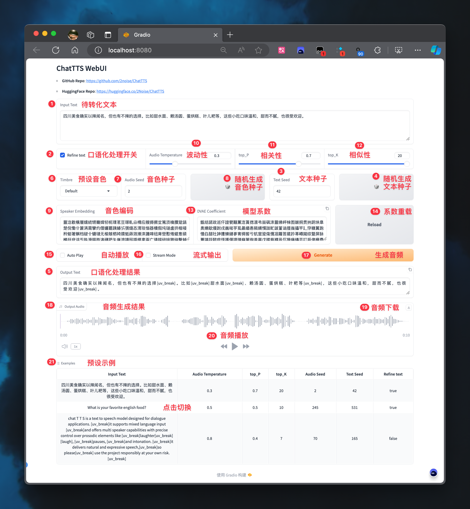
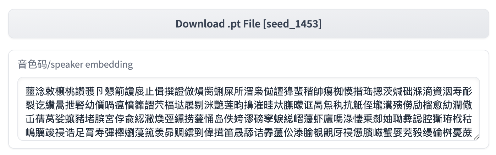

<div align="center">

**English** | [简体中文](./README.md)

</div>

Awesome-ChatTTS is the officially recommended collection of ChatTTS resources. Feel free to recommend or self-recommend in the issues.

If you find this project helpful in using ChatTTS, please give it a ⭐️ to show your support.

> [!NOTE]
> The following projects are all community resources. For official information, please visit the source repository [2noise/ChatTTS](https://github.com/2noise/ChatTTS).

* [Official Introduction](#official-introduction)
* [Quick Experience](#quick-experience)
* [Popular Branches](#popular-branches)
* [Interface Description](#interface-description)
* [Tone Control](#tone-control)
* [Beginner Tutorial](#beginner-tutorial)
* [FAQs](#faqs)

## Official Introduction

https://github.com/libukai/Awesome-ChatTTS/assets/5654585/532bfb80-316a-4244-9b92-301c732e8b63

## Quick Experience

|                             URL                             | Type                        |
| :---------------------------------------------------------: | --------------------------- |
|           [ Original Web](https://chattts.com/#Demo)           | Original Web Experience     |
| [Forge Web](https://huggingface.co/spaces/lenML/ChatTTS-Forge) | Forge Enhanced Experience   |
|           [Linux](https://pypi.org/project/ChatTTS/)           | Python Installation Package |
|              [Samples](http://ttslist.aiqbh.com/)              | Tone Seed Samples           |
|          [Cloning](http://region-9.autodl.pro:41137/)          | Tone Cloning Experience     |

## Popular Branches

### Feature Enhancement

|                               Project                               |                                Star                                | Highlights                                                                       |
| :------------------------------------------------------------------: | :-----------------------------------------------------------------: | -------------------------------------------------------------------------------- |
|  [jianchang512/ChatTTS-ui](https://github.com/jianchang512/ChatTTS-ui)  |  | Provides API interface for third-party applications                              |
|    [6drf21e/ChatTTS_colab](https://github.com/6drf21e/ChatTTS_colab)    |    | Supports long audio generation and role reading                                  |
|      [lenML/ChatTTS-Forge](https://github.com/lenML/ChatTTS-Forge)      |      | Voice enhancement and background noise reduction, allows additional prompt words |
| [CCmahua/ChatTTS-Enhanced](https://github.com/CCmahua/ChatTTS-Enhanced) |  | Support for Batch File Processing and Exporting SRT Files                        |
|  [HKoon/ChatTTS-OpenVoice](https://github.com/HKoon/ChatTTS-OpenVoice)  |  | Integration with OpenVoice for Voice Cloning                                     |

### Feature Expansion

|                                     Project                                     |                                   Star                                   | Highlights                                 |
| :------------------------------------------------------------------------------: | :-----------------------------------------------------------------------: | ------------------------------------------ |
|        [6drf21e/ChatTTS_Speaker](https://github.com/6drf21e/ChatTTS_Speaker)        |        | Tone Role Tagging and Stability Evaluation |
|          [AIFSH/ComfyUI-ChatTTS](https://github.com/AIFSH/ComfyUI-ChatTTS)          |          | ComfyUi workflow node                      |
| [MaterialShadow/ChatTTS-manager](https://github.com/MaterialShadow/ChatTTS-manager) |  | Tone Management System                     |

## Interface Description



### Text Control

* **1. Input Text**: Text to be converted, supports mixed Chinese and English
* **2. Refine text**: Whether to process the text into colloquial form
* **3. Text Seed**: Configure text seed value, different seeds correspond to different colloquial styles
* **4. 🎲**: Generate random text seed value
* **5. Output Text**: Text generated after colloquial processing

### Tone Control

* **6. Timbre**: Preset timbre seed value
* **7. Audio Seed**: Configure audio seed value, different seeds correspond to different tones
* **8. 🎲**: Generate random audio seed value
* **9. Speaker Embedding**: Timbre code, see [Tone Control](#tone-control)

### Emotion Control

* **10. Temperature**: Control audio emotional fluctuation, range is 0-1, the larger the number, the greater the fluctuation
* **11. top_P**: Control audio emotional relevance, range is 0.1-0.9, the larger the number, the higher the relevance
* **12. top_K**: Control audio emotional similarity, range is 1-20, the smaller the number, the higher the similarity

### Coefficient Control

* **13. DVAE Coefficient**: Model coefficient code
* **14. Reload**: Reload model coefficient

### Playback Control

* **15. Auto Play**: Whether to automatically play after generating audio
* **16. Stream Mode**: Whether to enable streaming output
* **17. Generate**: Click to generate audio file
* **18. Output Audio**: Audio generation result
* **19. ↓**: Click to download audio file
* **20. ▶️**: Click to play audio file

### Example Control

* **21. Example**: Click to switch example configurations

## Tone Control

After testing, specifying a timbre seed value each time generates `spk_emb` and reusing pre-generated `spk_emb` results in significant differences. It is recommended to prioritize using `.pt` timbre files or timbre codes (in string form).

In the [ChatTTS_Speaker](https://huggingface.co/spaces/taa/ChatTTS_Speaker) project, preliminary tagging and stability evaluation of timbre seeds have been conducted. Examples can be used to quickly select suitable timbres.



### WebUI

When using the official WebUI, you can directly copy the timbre code and replace the value in `9. Speaker Embedding` to achieve timbre control.

### Python

When using in a Python script, refer to the compression scheme in [issue#07](https://github.com/6drf21e/ChatTTS_Speaker/issues/7) to implement timbre control.

``` python
spk = torch.load("asset/seed_1332_restored_emb.pt", map_location=torch.device('cpu')).detach()
spk_emb_str = compress_and_encode(spk)

params_infer_code = ChatTTS.Chat.InferCodeParams(
    spk_emb= spk_emb_str,  # add sampled speaker
    temperature=.0003,  # using custom temperature
    top_P=0.7,  # top P decode
    top_K=20,  # top K decode
)
```

## Beginner Tutorial

### English Tutorials

|                                                                    Video                                                                     | Highlights            |
|:-----------------------------------------------------------------------------------------------------------------------------------------:|----------------------|
|                     [Sam Witteveen](https://www.youtube.com/watch?v=L4klnZ5Lox8)                      | Conversational TTS Step by Step         |

### Chinese Tutorials

|                                                                    Video                                                                     | Highlights            |
|:-----------------------------------------------------------------------------------------------------------------------------------------:|----------------------|
|                     [Tongji Zihua Bro](https://www.bilibili.com/video/BV1Ui421v7JU/?vd_source=b958002f14b88fc59432b810e4448b72)                      | Detailed deployment tutorial from beginner to advanced |
|                      [ZTFS](https://www.bilibili.com/video/BV1nZ421p74z/?vd_source=6773fc664ee1e277b8a2290d66ebb7a3)                      | Mac M1 deployment tutorial   |
| [Wang Baobao](https://www.bilibili.com/video/BV1Ji421U74a/?spm_id_from=333.337.search-card.all.click&vd_source=6773fc664ee1e277b8a2290d66ebb7a3) | Windows deployment tutorial  |


## FAQs

With recent iterations, the issues in the source repository code have been mostly resolved. If you encounter problems, it is recommended to first review the [Official Documentation in Chinese](https://github.com/2noise/ChatTTS/blob/main/docs/cn/README.md). 

## Project Trends

[](https://star-history.com/#libukai/Awesome-ChatTTS&Date)
