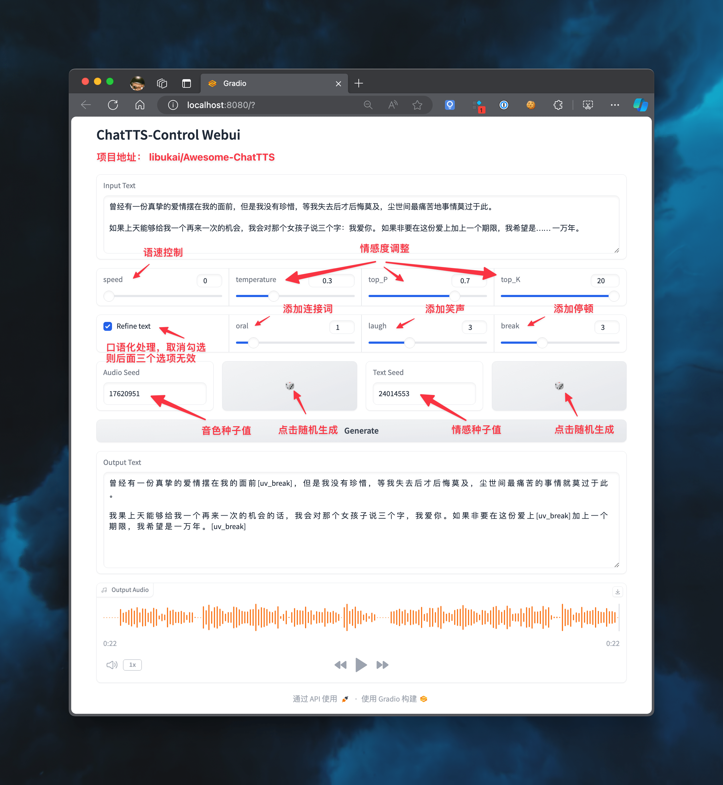
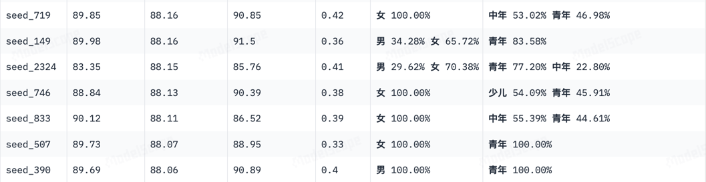
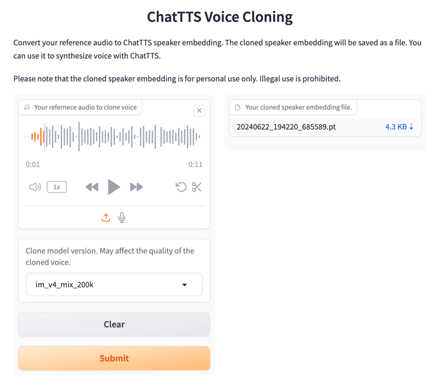

# Awesome-ChatTTS

本项目是官方推荐的 ChatTTS 最佳入门指南，整理和汇总了常见问题和相关资源。

如有好的项目推荐或者自荐，请在 issues 中留言，我会在验证后添加。

如果觉得对你使用 ChatTTS 有用，还请打赏个 ⭐️ 支持一下。

* [官方简介](#官方简介)
* [快速体验](#快速体验)
* [热门分支](#热门分支)
* [参数说明](#参数说明)
* [音色种子](#音色种子)
* [安装指南](#安装指南)
* [常见问题](#常见问题)
* [报错速查](#报错速查)

## 官方简介

https://github.com/libukai/Awesome-ChatTTS/assets/5654585/532bfb80-316a-4244-9b92-301c732e8b63

## 快速体验

|                                                    网址                                                     | 亮点                    |
|:---------------------------------------------------------------------------------------------------------:|-----------------------|
|                                   [Web](https://chattts.in/playground)                                    | 原版网页版体验               |
| [Colab](https://colab.research.google.com/github/6drf21e/ChatTTS_colab/blob/main/chattts_webui_mix.ipynb) | 原版代码版体验               |
|                                [Forge Web](https://huggingface.co/spaces/lenML/ChatTTS-Forge)                                 | Forge 功能增强版体验         |
|                  [OpenVoice Web](https://huggingface.co/spaces/Hilley/ChatTTS-OpenVoice)                  | OpenVoice 语音克隆版体验     |
|                    [Win/Mac](https://pan.baidu.com/s/1t3XddrF8KBJ2dYqmwvqOQw?pwd=nmhx)                    | Win/Mac 安装包，界面美观带降噪功能 |
|                              [Linux](https://pypi.org/project/chattts-fork/)                              | Python 整合一键包，后续等待官方更新 |
|                                   [Samples](http://ttslist.aiqbh.com/)                                    | 音色种子打标与评估，可以下载使用      |

## 热门分支

|                                      项目                                      |                                                 Star                                                 | 亮点                               |
|:----------------------------------------------------------------------------:|:----------------------------------------------------------------------------------------------------:|----------------------------------|
|             [2noise/ChatTTS](https://github.com/2noise/ChatTTS)              |                                           | 源仓库，问题较多，请参见下方解决方案               |
|    [jianchang512/ChatTTS-ui](https://github.com/jianchang512/ChatTTS-ui)     |                                  | 整理了详细的安装说明， 尤其是 GPU 相关问题         |
|          [6drf21e/ChatTTS_colab](https://github.com/6drf21e/ChatTTS_colab)           |                                    | Google Colab 一键部署快速体验            |
|           [lenML/ChatTTS-Forge](https://github.com/lenML/ChatTTS-Forge)            |                                      | 提供了 ChatTTS 封装，适合技术流深入研究         |
|            [yihong0618/ChatTTS](https://github.com/yihong0618/ChatTTS)             |                                       | Pypi 包一键安装，便于小白体验项目效果            |
| [6drf21e/ChatTTS_Speaker](https://github.com/6drf21e/ChatTTS_Speaker) |                                  | 音色角色打标与稳定性评估                     |
|         [AIFSH/ComfyUI-ChatTTS](https://github.com/AIFSH/ComfyUI-ChatTTS)          |                                    | ComfyUi 版本，可作为工作流节点引入            |
|               [Kedreamix/ChatTTS](https://github.com/Kedreamix/ChatTTS)                |                                        | 技术向的源代码解读                        |
|            [CyberWon/ChatTTS-API](https://github.com/CyberWon/ChatTTS-API)            |                                     | 增强版 API 接口，带有流式输出能力              |
| [HKoon/ChatTTS-OpenVoice](https://github.com/HKoon/ChatTTS-OpenVoice) |                                  | 配合 OpenVoice 进行声音克隆              |
| [Jackiexiao/ChatTTS-api-ui-docker](https://github.com/Jackiexiao/ChatTTS-api-ui-docker) |                         | 提供 腾讯云 Docker 镜像，仅支持带 CUDA 的 GPU |
| [MaterialShadow/ChatTTS-manager](https://github.com/MaterialShadow/ChatTTS-manager) |                         | 提供了音色管理系统和 WebUI 界面              |
| [TommyZihao/ChatTTS_Tutorials](https://github.com/TommyZihao/ChatTTS_Tutorials)  |                         |     代码教程：五分钟部署开源语音合成神器ChatTTS          |

## 视频教程

|                                                                    视频                                                                     | 亮点            |
|:-----------------------------------------------------------------------------------------------------------------------------------------:|---------------|
|                     [同济子豪兄](https://www.bilibili.com/video/BV1Ui421v7JU/?vd_source=b958002f14b88fc59432b810e4448b72)                      | 从入门到进阶的详细部署教程 |
|                      [ZTFS](https://www.bilibili.com/video/BV1nZ421p74z/?vd_source=6773fc664ee1e277b8a2290d66ebb7a3)                      | Mac M1 部署教程   |
| [王-寳寳](https://www.bilibili.com/video/BV1Ji421U74a/?spm_id_from=333.337.search-card.all.click&vd_source=6773fc664ee1e277b8a2290d66ebb7a3) | Windows 部署教程  |


## 讨论社区

* [官方项目 Issues](https://github.com/2noise/ChatTTS/issues)
* 官方讨论 QQ 群：
  - 808364215 (已满) 
  - 230696694 (已满) 
  - 933639842（可加入）


## 参数说明

本图示仅用于展示各参数的含义，对应的 WebUI 还在等待 PR 合并中，请关注源仓库 [2noise/ChatTTS](https://github.com/2noise/ChatTTS) 的更新。



### 情感控制

* **speed** : 控制音频速度，范围为 0-9，数字越大，速度越快
* **temperate** : 控制音频情感波动性，范围为 0-1，数字越大，波动性越大
* **top_P** ：控制音频的情感相关性，范围为 0.1-0.9，数字越大，相关性越高
* **top_K** ：控制音频的情感相似性，范围为 1-20，数字越小，相似性越高

### 文本控制

* **Refine text** : 控制是否对文本进行口语化处理，取消勾选则后面三个选项无效
* **oral** : 控制文本口语化程度，范围为 0-9，数字越大，添加的“就是”、“那么”之类的连接词越多
* **laugh** : 控制文本是否添加笑声，范围为 0-9，数字越大，笑声越多
* **break** : 控制文本是否添加停顿，范围为 0-9，数字越大，停顿越多

### 种子控制

* **Audio Seed** : 配置音色种子值，不同种子对应不同音色，不同种子间差异性较大
* **Text Seed** : 配置情感种子值，不同种子对应不同情感，不同种子间差异性较小

## 音色种子

经过代码审查和实际测试，指定音色种子值每次生成 `spk_emb` 和重复使用预生成好的 `spk_emb` 效果有细微差异，建议有能力优先使用 `.pt` 音色文件。

在 [ttwwwaa/ChatTTS_Speaker](https://modelscope.cn/studios/ttwwwaa/ChatTTS_Speaker/summary) 项目中对音色种子进行了初步打标和稳定性评估，可以快速通过示例来选择合适的音色种子。



此外，也可以尝试使用 [ChatTTS Voice Cloning](http://region-9.autodl.pro:41137/) 自行克隆需要的音色。



## 安装指南

本安装指南适用于需要运行源仓库代码的用户，小白用户建议使用 [快速体验](#快速体验) 中的方法。

### 快速安装

```bash
pip install git+https://github.com/2noise/ChatTTS
```

### 手动安装

1. 根据设备类型，下载 [Miniconda](https://docs.anaconda.com/free/miniconda/) 并安装
2. 在终端中下载项目代码
``` bash
git clone https://github.com/2noise/ChatTTS
```
3. 进入项目目录
``` bash
cd ChatTTS
```
4. 创建 conda 环境并激活
```bash
conda create -n chattts
conda activate chattts
```
5. 安装基本依赖
```bash
pip install -r requirements.txt
```
6. 运行 web-ui
``` bash
python examples/web/webui.py

# 首次运行会下载模型，如果可以科学上网请耐心等待下载完成
# 如果无法下载，可以参考 **模型无法下载** 问题中的解决方案修改代码
# 显示以下信息，则表示运行成功：

Running on local URL:  http://0.0.0.0:8080
```
7. 打开浏览器访问 http://localhost:8080

## 常见问题

源仓库代码直接运行可能遇到的问题较多，可以根据以下清单快速解决。

### 依赖版本过低

老版项目中 `requirement.txt` 中列出的依赖版本较老，在部分环境下可能会出现报错，建议更新至最新版依赖文件。

```conf
numpy<2.0.0
omegaconf>=2.3.0
torch>=2.1.0
tqdm
vector_quantize_pytorch
transformers>=4.41.1
vocos
IPython
gradio
python-dotenv
pynini==2.1.5
WeTextProcessing
nemo_text_processing
```

### 模型无法下载

原版项目运行需要从 HuggingFace 下载对应的模型，如果不能顺畅科学上网，那么就无法完成这一步。作为替代方案，可以从 [modelscope](https://www.modelscope.cn/models/pzc163/chatTTS/summary) 上下载模型和配置，并配置本地路径。

> [!Important]
> 魔塔上的模型库是由志愿者维护的，不保证所有模型都是最新的，如果有需要请自行验证。

1. 在终端中安装 modelscope 依赖

``` bash
pip install modelscope
```

2. 修改 webui.py 中的代码

``` python
# 在开头导入依赖，并下载模型和配置
from modelscope import snapshot_download
model_dir = snapshot_download('zlj2546/ChatTTS')

# 第 118 行修改模型路径
ret = chat.load_models('custom', custom_path=model_dir)
```

### 音频无法保存

通过脚本运行时，音频保存官方推荐使用 torchaudio，实测最新版本已经可以正常运行。如果运行有问题，也可以使用 soundfile 库进行音频保存。

``` python
import soundfile

wavs = chat.infer(text, skip_refine_text=True, params_refine_text=params_refine_text,  params_infer_code=params_infer_code)
soundfile.write("output1.wav", wavs[0][0], 24000)
```

### 语气标签被读出

出现这个问题是因为官方代码处理中文标点符号时覆盖不全，例如 `？`、`…` 等符号没有被处理，导致模型生成时出错。

可以手动删除类似的中文标点符号，或者修改 `ChatTTS/utils/infer_utils.py` 中的代码，在 103 行的 `character_map` 的字典中添加缺失的标点符号。

```Python
character_map = {
    '…': '',
    '—': ',',
    '＿': ',',
    '？': ',',
    }
```

### GPU 无法使用

GPU 至少需要 4G 显存，否则将强制使用 CPU，相关问题可以参考 [ChatTTS-ui](https://github.com/jianchang512/ChatTTS-ui) 项目中的说明

## 报错速查

1、`load_models() got an unexpected keyword argument 'source'`

详见 **常见问题 - 模型无法下载**

2、`cannot import name 'CommitOperationAdd' from 'huggingface_hub'`
   
详见 **常见问题 - 模型无法下载**

3、 `FileNotFoundError：［Erzno 2］ No such file or directory： 'C：\\Users\\xxx\\.cache\\huggingface\\hub\\models--2Noise--ChatTTS\\snapshots\`

详见 **常见问题 - 模型无法下载**

4、`local variable 'Normalizer' referenced before assignment`

需要根据 **安装指南** 完成环境配置后，再安装 `pynini` 和 `WeTextProcessing` 依赖

``` bash
conda install -c conda-forge pynini=2.1.5 && pip install WeTextProcessing
```

5、`Couldn't find appropriate backend to handle uri output1.wav and format wav.`

详见 **常见问题 - 音频保存**

6、`Could not find a version that satisfies the requirement torch~=2.1.0`

详见 **常见问题 - 依赖版本**

7、`ModuleNotFoundError : No module named'Cython'`

未找到 Python 执行路径，Windows 设备需要按 [教程](https://www.cnblogs.com/ajianbeyourself/p/17654155.html) 配置环境路径


## 项目趋势

[](https://star-history.com/#libukai/Awesome-ChatTTS&Date)
