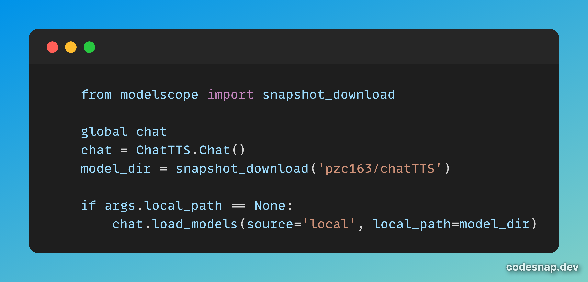

# ChatTTS-Control

Fork from [ChatTTS](https://github.com/2noise/ChatTTS)

ChatTTS-Control 在原版 web-ui 的基础上，增加了更多的控制参数，可以更灵活地控制音频生成的效果。

此外，还整理和汇总了 ChatTTS 相关的常见问题和扩展资源，争取成为 ChatTTS 项目的最佳参考。如果您觉得有用，还请打赏个 Star 支持一下。

* [项目亮点](#项目亮点)
* [功能优化](#功能优化)
* [参数说明](#参数说明)
* [音色种子](#音色种子)
* [音频示例](#音频示例)
* [安装指南](#安装指南)
* [常见问题](#常见问题)
* [相关推荐](#相关推荐)
* [计划路线](#计划路线)

---

## 项目亮点

1. 抽离了更多参数，在 web-ui 中可以更加方便地进行调整。
2. 收集和测试不同音色 Seed ，整理成表格方便选用。
3. 整理了各个细分方向上的 fork 资源，满足更多场景下的使用需求。
4. 整理了常见报错的解决方案，方便快速定位和解决问题。

---

## 功能优化

1. 添加了遗漏的需处理的中文标点字符，修复了生成的语音中可能出现的读出控制单元的问题。
2. 增加了多音字的初步处理，主要是“得”和“地”，使生成的语音听起来更加自然流畅。
3. 增加了长文本分段功能，分段处理后自动再合并为单个音频文件，避免了过长的文本生成效果失控的问题。
4. 增加了 script.py 示例脚本，包含了常见问题中解决方案的说明 。

---

## 参数说明


### 情感控制

* **speed** : 控制音频速度，范围为 0-9，数字越大，速度越快
* **temperate** : 控制音频情感波动性，范围为 0-1，数字越大，波动性越大
* **top_P** ：控制音频的情感相关性，范围为 0.1-0.9，数字越大，相关性越高
* **top_K** ：控制音频的情感相似性，范围为 1-20，数字越小，相似性越高

### 文本控制

* **Refine text** : 控制是否对文本进行口语化处理，取消勾选则后面三个选项无效
* **oral** : 控制文本口语化程度，范围为 0-9，数字越大，添加的“就是”、“那么”之类的连接词越多
* **laugh** : 控制文本是否添加笑声，范围为 0-9，数字越大，笑声越多
* **break** : 控制文本是否添加停顿，范围为 0-9，数字越大，停顿越多

### 种子控制

* **Audio Seed** : 配置音色种子值，不同种子对应不同音色，不同种子间差异性较大
* **Text Seed** : 配置情感种子值，不同种子对应不同情感，不同种子间差异性较小

---

## 音色种子

在 [samples](https://github.com/libukai/ChatTTS-Control/tree/main/samples) 目录下提供了一些音色种子的示例，可以通过这些示例来选择合适的音色种子。

例如 `output2.wav` 是 `Audio Seed` 为 2 的音色种子对应的音频，`output111.wav` 是 `Audio Seed` 为 3 的音色种子对应的音频。

### 男生

| Seed | 类型 | 年龄 | 风格   |
|:----:|:--:|:--:|------|
| 111  | 男声 | 青年 | 文艺范  |
| 333  | 男声 | 青年 | 食草系  |
| 666  | 男声 | 中年 | 白领   |
| 7777 | 男声 | 中年 | 港系配音 |
| 9999 | 男声 | 中年 | 低沉深邃 |

### 女生

| Seed | 类型 | 年龄 | 风格   |
|:----:|:--:|:--:|------|
|  2   | 女声 | 青年 | 情感丰富 |
|  4   | 女声 | 中年 | 感情深邃 |
| 1111 | 女声 | 中年 | 清澈干净 |
| 3333 | 女声 | 中年 | 淡然平静 |

## 音频示例

### 关闭 Refine Text，不进行口语化处理

https://github.com/libukai/ChatTTS-Control/assets/5654585/ad133c85-e1f3-44aa-9ed4-6b0374345518

### 打开 Refine Text，进行口语化处理

https://github.com/libukai/ChatTTS-Control/assets/5654585/855b30bf-6bcc-4d57-9a14-8e205dc62c54

## 安装指南

1. 根据设备类型，下载 [Miniconda](https://docs.anaconda.com/free/miniconda/) 并安装
2. 在终端中下载项目代码
``` bash
https://github.com/libukai/ChatTTS-Control.git
```
3. 进入项目目录，安装基本依赖
``` bash
cd ChatTTS-Control
pip install -r requirements.txt
```
4. 安装中文依赖
``` bash
conda install -c conda-forge pynini=2.1.5 && pip install nemo_text_processing
```
5. 出现如下报错，Windows 设备需要按 [教程](https://www.cnblogs.com/ajianbeyourself/p/17654155.html) 配置环境路径
```bash
ModuleNotFoundError : No module named'Cython'
```
5. 运行 web-ui
``` bash
python webui.py

# 首次运行会下载模型，如果可以科学上网请耐心等待下载完成
# 如果无法下载，可以参考 **模型下载** 问题中的解决方案修改代码
# 显示以下信息，则表示运行成功：

Running on local URL:  http://0.0.0.0:8080
```
6. 打开浏览器访问 http://localhost:8080

## 常见问题

### 依赖版本过低

原版项目中 `requirement.txt` 中列出的依赖版本较老，在部分环境下可能会出现报错，可以根据报错信息安装更高版本。

本项目建议使用 Python 3.10，`torch` 及相关依赖升级至 2.3.0。

```conf
omegaconf~=2.3.0
torch~=2.3.0
torchaudio==2.3.0
tqdm~=4.66.4
einops~=0.8.0
vector-quantize-pytorch~=1.14.24
transformers~=4.41.1
vocos~=0.1.0
ipython==8.25.0
huggingface-hub~=0.23.2
gradio~=4.32.2
numpy~=1.26.4
modelscope==1.15.0
```

### 模型无法下载

原版项目运行需要从 HuggingFace 下载对应的模型，如果不能顺畅科学上网，那么就无法完成这一步。作为替代方案，请从 [modelscope](https://www.modelscope.cn/models/pzc163/chatTTS/summary) 或者 [hf-mirror](https://hf-mirror.com/2Noise/ChatTTS) 上下载模型，并配置本地路径。

1. 在终端中安装 modelscope 依赖

``` bash
pip install modelscope
```

2. 修改 webui.py 中的代码

``` python
# 第 10 行添加导入依赖
from modelscope import snapshot_download

# 第 102 行添加模型下载代码
model_dir = snapshot_download('pzc163/chatTTS')

# 第 104 行修改模型路径
chat.load_models(source='local', local_path=model_dir)
```


### 音频无法保存

通过脚本运行时，音频保存官方推荐使用 torchaudio，实测最新版本已经可以正常运行。如果运行有问题，也可以使用 soundfile 库进行音频保存。

 1. 官方示例中 torchaudio 代码有误，需要进行修正：

``` python
import torchaudio
#  需要将 chat.infer 生成的文件对象修正为 wavs
wavs = chat.infer(text, skip_refine_text=True, params_refine_text=params_refine_text,  params_infer_code=params_infer_code)
torchaudio.save("output2.wav", torch.from_numpy(wavs[0]), 24000)
```

2. 也可以使用 soundfile 库进行音频保存：

``` python
import soundfile

wavs = chat.infer(text, skip_refine_text=True, params_refine_text=params_refine_text,  params_infer_code=params_infer_code)
soundfile.write("output1.wav", wavs[0][0], 24000)
```

### 语气标签被读出

出现这个问题是因为官方代码处理中文标点符号时覆盖不全，例如 `？`、`…` 等符号没有被处理，导致模型生成时出错。

可以手动删除类似的中文标点符号，或者改用本 Fork 项目，代码增加了更多的中文标点符号处理逻辑。


### 运行代码报错

官方示例以 IPython 为基础，导致在终端和其他 IDE 运行时缺少了很多依赖，可以根据报错进行安装。

1、`load_models() got an unexpected keyword argument 'source'`

详见 **模型下载**

2、`cannot import name 'CommitOperationAdd' from 'huggingface_hub'`
   
详见 **模型下载**

3、`local variable 'Normalizer' referenced before assignment`

需要安装 [conda](https://docs.anaconda.com/free/miniconda/) 环境后，再安装 `pynini` 和 `nemo_text_processing` 依赖

``` bash

conda install -c conda-forge pynini=2.1.5 && pip install nemo_text_processing
```

4、`Couldn't find appropriate backend to handle uri output1.wav and format wav.`

详见 **音频保存**

5、`Could not find a version that satisfies the requirement torch~=2.1.0`

详见 **依赖版本**

6、`ModuleNotFoundError : No module named'Cython'`

详见 **安装指南**

## 相关推荐
|                            项目                             |                                                                                           Star                                                                                           | 亮点                               |
|:---------------------------------------------------------:|:----------------------------------------------------------------------------------------------------------------------------------------------------------------------------------------:|----------------------------------|
|       [ChatTTS](https://github.com/2noise/ChatTTS)        |  | 源仓库，问题较多，issue 中问题讨论热烈           |
| [ChatTTS-ui](https://github.com/jianchang512/ChatTTS-ui)  |   | 提供 Docker 镜像和 API，方便与其他项目集成      |
| [ChatTTS_colab](https://github.com/6drf21e/ChatTTS_colab) |   | Google Colab 一键部署，还有音色抽卡功能       |
|   [ChatTTS-fork](https://github.com/yihong0618/ChatTTS)   |   | Pypi 包一键安装，便于小白体验项目效果            |
| [ChatTTS-Forge](https://github.com/lenML/ChatTTS-Forge) |   | 提供了完善的 ChatTTS 封装，适合技术流深入研究      |
| [ComfyUI-ChatTTS](https://github.com/AIFSH/ComfyUI-ChatTTS) |    | ComfyUi 版本，可作为工作流节点引入            |
| [ChatTTS-Control](https://github.com/libukai/ChatTTS-Control) |    | 提供更多控制参数和详细解读，汇总相关资源推荐           |
| [ChatTTS-api-ui-docker](https://github.com/Jackiexiao/ChatTTS-api-ui-docker) |   | 提供 腾讯云 Docker 镜像，仅支持带 CUDA 的 GPU |

---

## 计划路线

- [x] 跟随原版仓库更新
- [ ] 持续更新音色种子表和相关推荐
- [ ] 生成开箱可用的 Docker 镜像

---

## 项目趋势

[](https://star-history.com/#libukai/ChatTTS-Control&Date)
